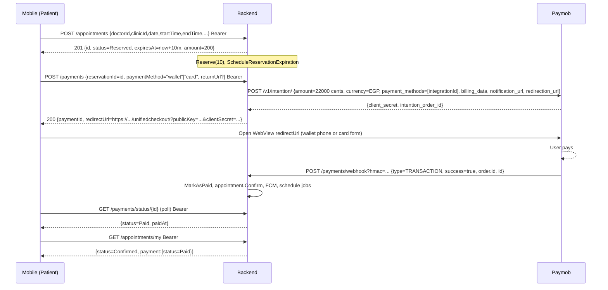
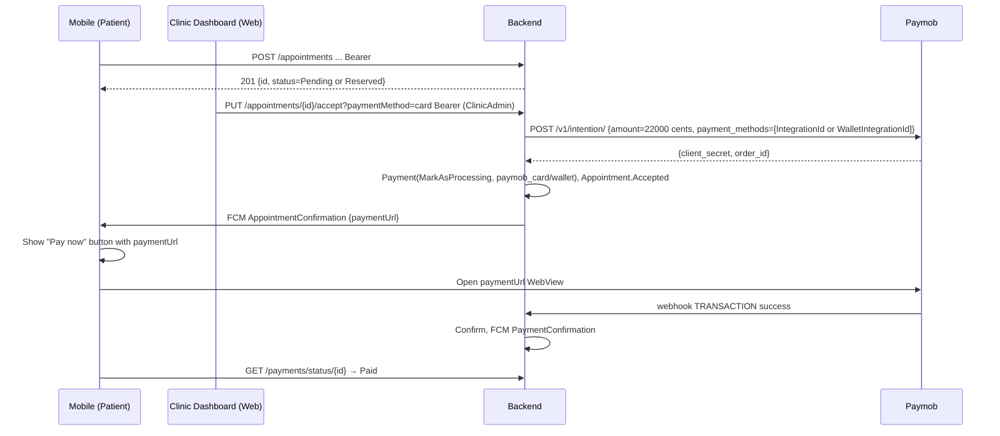

# Appointment Payment — Wallet / Credit Update — Mobile Workflow

> **Backend:** `E:\ClinicHub` (ASP.NET Core 10, MediatR CQRS, Paymob Intention API UnifiedCheckout)  
> **Frontend (dashboard):** `E:\ClinicHub-Frontend` — unchanged, design-only, payments are read-only revenue table.  
> **Date:** 2026-08-28 — **Status:** Implemented & building, see Changed Files below.

---

## 1. Summary of Change

**Goal:** Appointments can now pay with **wallet** (`PaymobWallet` — Vodafone Cash / Orange Money / Eg. etc. via Paymob) **or credit card** (`PaymobCreditCard`) **just like subscriptions and ads**.

| Area | Before | After |
|------|--------|-------|
| `POST /payments/initiate` | hardcoded `InitiateWalletPaymentAsync` (wallet only) | `paymentMethod` body field → wallet **or** card (`PaymentMethodMapper`) |
| `POST /payments` (booking/reservation) | hardcoded `InitiateCheckoutPaymentAsync` (card only) | `paymentMethod` + `returnUrl` → wallet **or** card, backward compat keeps card when omitted |
| `PUT /appointments/{id}/accept` (clinic admin) | hardcoded checkout (card) | `?paymentMethod=wallet|card&returnUrl=` query **or** JSON body; falls back to card |
| `PUT /staff/appointments/{id}/approve` | same hardcoded path | now `?paymentMethod=&returnUrl=` + body support |
| `PUT /doctors/appointments/{id}/accept` | same | same |
| `PUT /doctors/appointments/{id}/status` with `status=6` | called `AcceptAsync` without method | now forwards `paymentMethod`/`returnUrl` |

No new tables. No internal wallet ledger — `Wallet` means **Paymob Wallet integration**, `Credit` means **Paymob Card integration** (same `Payment` entity, `Type=Appointment`).

Internal wallet balance (top-up / deduction) **does not exist** in either backend or frontend. Grep of `ClinicHub.Domain` confirms zero `Wallet`/`Credit`/`Balance` entities. If you need an in-app stored balance, see §9 Future Work.

---

## 2. Enums & Constants

### 2.1 AppointmentStatus `E:\ClinicHub\ClinicHub.Domain\Enums\AppointmentStatus.cs:3`
```csharp
Pending = 0, Confirmed = 1, Cancelled = 2, Completed = 3,
Reserved = 4, NoShow = 5, Accepted = 6, Rejected = 7
```
Dashboard strings: `pending`, `reserved`, `accepted`/`awaiting-payment` (6), `confirmed`, `cancelled`, `rejected`, `completed`.

### 2.2 PaymentType `E:\ClinicHub\ClinicHub.Domain\Enums\PaymentType.cs:3`
`Appointment=0, Subscription=1, Ads=2`

### 2.3 PaymentStatus `E:\ClinicHub\ClinicHub.Domain\Enums\PaymentStatus.cs:3`
`Pending=0, Paid=1, Failed=2, Refunded=3, Processing=4` — webhook handles both `Pending` and `Processing` as unpaid.

### 2.4 PaymentMethod `E:\ClinicHub\ClinicHub.Domain\Enums\PaymentMethod.cs:3`
`Cash=0, PaymobWallet=1, PaymobCreditCard=2`

Mapper `E:\ClinicHub\ClinicHub.Application\Features\AdminPayments\PaymentMethodMapper.cs:6`
- `ToEnum(null|"")` → `PaymobWallet`
- `"wallet" | "paymob_wallet" | "paymob" | "paymobwallet"` → `PaymobWallet`
- `"card" | "creditcard" | "credit_card" | "paymob_card" | "visa" | "mastercard"` → `PaymobCreditCard`
- `"cash"` → `Cash` (clinic-side manual only)
- Case-insensitive, trims.
- `ToDbString`: Cash→`cash`, Card→`paymob_card`, Wallet→`paymob_wallet` (stored in `Payment.PaymentMethod` column, `RedirectUrl` holds Paymob URL).

### 2.5 Subscription / Ads parity
- `POST /subscriptions/initiate-payment` body `{ PlanId, Period, PaymentMethod?, ReturnUrl? }` — same mapper.
- `POST /clinics/{clinicId}/ads/orders` body `{ AdPackageId, DurationDays, LogoImageUrl?, ReturnUrl?, PaymentMethod? }` — same mapper.

---

## 3. BookingConfiguration & Pricing

`E:\ClinicHub\ClinicHub.Domain\Entities\BookingConfiguration.cs:7` per clinic:
```
ConsultationFee decimal (EGP), Currency="EGP",
MaxAdvanceBookingDays=30, ReservationTtlMinutes=10, CancellationWindowMinutes=120
```
`E:\ClinicHub\ClinicHub.Application\Common\AppointmentPricingCalculator.cs:10`
```csharp
platformFee = percent <=0 ? 0 : round(fee * percent/100, 2)
total      = fee + platformFee
```
`PlatformSetting.AppointmentFeePercent` (single row) — percent added on top. Clinic keeps full `ConsultationFee`; patient pays `total`.  
Example: fee 200 EGP, platform 10% → patient pays 220 EGP (`AppointmentAcceptanceService` now includes fee, same as booking handlers).

---

## 4. API Routes (prefix `api/v{version:apiVersion}` → `api/v1`)

Full table `E:\ClinicHub\ClinicHub.API\Routes\ApiRoutes.cs:136`

| Purpose | Method | Route | Auth | File |
|---------|--------|-------|------|------|
| Create appointment | POST | `/appointments` + `/admin/dashboard/appointments` | Any authenticated | `AppointmentsController.cs:74` |
| Get slots | GET | `/clinics/{clinicId}/doctors/{doctorId}/slots?date=YYYY-MM-DD` + `/admin/dashboard/clinics/{clinicId}/doctors/{doctorId}/slots` | Auth | `SlotsController.cs:17` |
| Get booking config | GET | `/clinics/{clinicId}/booking-config` | Auth | — |
| Initiate payment (generic) **UPDATED** | POST | `/payments/initiate` | Auth (patient must be `BookedByUserId`) | `PaymentsController.cs:29` |
| Create booking payment **UPDATED** | POST | `/payments` | Auth | `PaymentsController.cs:40` |
| Verify booking payment | POST | `/payments/verify` | Auth | `PaymentsController.cs:50` |
| Get payment status | GET | `/payments/status/{appointmentId}` | Auth (owner only) | `PaymentsController.cs:107` |
| Webhook (Paymob → backend) | POST | `/payments/webhook?hmac=...` body `ConfirmPaymentWebhookRequestDto` | AllowAnonymous | `PaymentsController.cs:88` |
| Get my appointments (mobile) | GET | `/appointments/my?pageNumber&...` | Auth | `AppointmentsController.cs:47` |
| Get by id | GET | `/appointments/{id}` | Auth | `AppointmentsController.cs:60` |
| Cancel (patient) | PUT | `/appointments/{id}/cancel` body `{ CancellationReason }` | Auth | `AppointmentsController.cs:150` |
| Accept (clinic admin) **UPDATED** | PUT | `/appointments/{id}/accept?paymentMethod=&returnUrl=` body `{ paymentMethod?, returnUrl? }` | ClinicAdmin | `AppointmentsController.cs:123` |
| Staff approve **UPDATED** | PUT | `/staff/appointments/{id}/approve?paymentMethod=&returnUrl=` | Staff | `StaffController.cs:49` |
| Doctor accept **UPDATED** | PUT | `/doctors/appointments/{id}/accept?paymentMethod=&returnUrl=` | Doctor | `DoctorDashboardController.cs:62` |
| Doctor unified status **UPDATED** | PUT | `/doctors/appointments/{id}/status` body `{ status:6, paymentMethod?, returnUrl?, notes? }` | Doctor | `DoctorDashboardController.cs:99` |
| Verify latest subscription | GET | `/payments/verify-latest-subscription` | Auth | `PaymentsController.cs:125` |
| Revenue (clinic dashboard) | GET | `/payments/appointments?status&...` + `/payments/appointments/stats` | Auth | — |

Headers every call: `Authorization: Bearer <jwt>`, `Content-Type: application/json`, `Accept-Language: ar` (Arabic localized errors).

---

## 5. Request / Response Contracts

### 5.1 Create appointment
`POST /api/v1/appointments`
```json
{
  "doctorId": "guid",
  "clinicId": "guid",
  "appointmentDate": "2026-08-30",
  "startTime": "10:00:00",
  "endTime": "10:30:00",
  "appointmentType": 0,
  "patientFullName": "Ahmed Ali",
  "patientAge": 30,
  "patientGender": 0,
  "complaint": "headache",
  "chronicDiseases": null
}
```
`201` → `AppointmentDto` `E:\ClinicHub\ClinicHub.Application\Features\Appointments\DTOs\AppointmentDto.cs:4`
```json
{
  "id": "guid",
  "status": "Reserved",
  "expiresAt": "2026-08-28T14:40:00",
  "amount": 200,
  "currency": "EGP",
  "paymentId": null,
  "paymentUrl": null
}
```
If `BookingConfiguration.ConsultationFee > 0` → `Status=Reserved`, `ExpiresAt=now+ReservationTtlMinutes` (default 10). Else `Pending`.  
Hangfire schedules `ReservationExpirationJob` at `ExpiresAt`; hourly sweep also expires. Expired → `Cancelled`.

### 5.2 Initiate payment — booking flow (Reserved)
`POST /api/v1/payments` — **new fields `paymentMethod` + `returnUrl`**

```json
{
  "reservationId": "appointment-guid",
  "paymentMethod": "wallet",
  "returnUrl": "myapp://payment-result"
}
```
`paymentMethod` values: `"wallet"` (PaymobWallet) | `"card"` | `"creditcard"` | `"credit_card"` | omit → legacy card checkout (backward compat). Case-insensitive.  
`returnUrl` overrides `PaymobSettings.RedirectionUrl`/`WebhookUrl` for this intention only (optional).

`200` → `BookingPaymentResponseDto` `E:\ClinicHub\ClinicHub.Application\Features\Payment\DTOs\BookingPaymentResponseDto.cs:5`
```json
{
  "paymentId": "guid",
  "reservationId": "guid",
  "amount": 220.00,
  "currency": "EGP",
  "status": 4,
  "transactionId": null,
  "redirectUrl": "https://accept.paymob.com/unifiedcheckout/?publicKey=...&clientSecret=...",
  "failureReason": null,
  "createdAt": "2026-08-28T14:30:00"
}
```
`status` = `Processing` (4) — webhook will flip to `Paid` (1).  
`redirectUrl` is the **Paymob UnifiedCheckout URL** — open in WebView / external browser (see §6).  
`amount` = `ConsultationFee + platformFee` (EGP, 2 decimals). Paymob receives `amount*100` cents (`PaymobService.cs:44`).

Errors: `404 ReservationNotFound`, `403 ReservationExpired` (if `DateTime.Now >= ExpiresAt`), `400 AppointmentNotPending` (status != Reserved), `400 AlreadyPaid`.

### 5.3 Initiate payment — generic (Pending/Reserved/Accepted)
`POST /api/v1/payments/initiate` — **new field `paymentMethod`**

```json
{
  "appointmentId": "guid",
  "paymentMethod": "card",
  "returnUrl": "https://myapp.example/payment/result"
}
```
Values same as §5.2 but **omit → wallet** (backward compat for old mobile builds that sent no method via this route).  
`200` → `InitiatePaymentResponseDto` `E:\ClinicHub\ClinicHub.Application\Features\Payment\DTOs\InitiatePaymentResponseDto.cs:3`
```json
{
  "paymentId": "guid",
  "paymentKey": "client_secret_from_paymob",
  "redirectUrl": "https://accept.paymob.com/unifiedcheckout/?publicKey=...&clientSecret=..."
}
```
Stored `Payment.PaymentMethod` = `paymob_wallet` or `paymob_card` (via mapper). Status `Processing`.

Errors: `404 AppointmentNotFound`, `401 Unauthorized` (not BookedByUserId), `400 AppointmentNotPending`, `400 AlreadyPaid`, `400 BookingConfigNotFound`.

### 5.4 Accept (clinic → payment link)
`PUT /api/v1/appointments/{id}/accept?paymentMethod=wallet&returnUrl=myapp://result`
Body alternative (JSON, optional):
```json
{ "paymentMethod": "card", "returnUrl": "myapp://result" }
```
Query overrides body. If both omitted → card checkout (original behavior).  
Same for `PUT /staff/appointments/{id}/approve` and `PUT /doctors/appointments/{id}/accept` and `PUT /doctors/appointments/{id}/status` with body `{"status":6,"paymentMethod":"wallet"}`.

`200` → `AppointmentAcceptanceResultDto` `E:\ClinicHub\ClinicHub.Application\Features\Appointments\DTOs\AppointmentAcceptanceResultDto.cs:10`
```json
{
  "appointmentId": "guid",
  "status": 6,
  "paymentId": "guid",
  "amount": 220.00,
  "currency": "EGP",
  "paymobRedirectUrl": "https://accept.paymob.com/unifiedcheckout/?publicKey=...&clientSecret=...",
  "paymobPaymentKey": "client_secret"
}
```
`amount` now includes platform fee (fixed).  
Side effects: `Appointment.Status=Accepted`, `Payment` created/refreshed with `MarkAsProcessing`, `ScheduleNoShowMarking @ AppointmentDate+EndTime+30m`, FCM `AppointmentConfirmation` to patient with `paymentUrl`, `AppointmentAccepted` to doctor+owner.

### 5.5 Get payment status (polling fallback)
`GET /api/v1/payments/status/{appointmentId}` → `PaymentStatusDto`
```json
{ "paymentId": "guid", "appointmentId": "guid", "status": 0, "amount": 220.00, "paidAt": null, "transactionId": null }
```
`status` enum §2.3. No `redirectUrl` here; use `GET /appointments/my` for `PaymobRedirectUrl`.

### 5.6 Verify booking payment (manual after redirect)
`POST /api/v1/payments/verify`
```json
{ "paymentId": "guid", "transactionId": "paymob_tx_or_cash_ref" }
```
If payment was `Processing|Pending` → `MarkAsPaid(transactionId, method ?? "cash")`, `appointment.Confirm(paymentId)`, schedule jobs, return `BookingPaymentResponseDto` with `Status=Paid`. If already `Paid` → returns current response. If `Failed` → throws `PaymentFailed`.

### 5.7 My appointments (mobile list)
`GET /api/v1/appointments/my?PageNumber=1&PageSize=20` → `PagginatedResult<MyAppointmentDto>`
`MyAppointmentDto` `E:\ClinicHub\ClinicHub.Application\Features\Appointments\DTOs\MyAppointmentDto.cs:8`
```json
{
  "id": "guid",
  "clinicId": "guid", "clinicName": "Al-Noor",
  "doctorId": "guid", "doctorName": "Dr. Samir",
  "date": "2026-08-30", "startTime": "10:00", "endTime": "10:30",
  "status": "Accepted",
  "rejectionReason": null,
  "payment": {
    "paymentId": "guid",
    "amount": 220.00,
    "currency": "EGP",
    "paymentStatus": 0,
    "paymobRedirectUrl": "https://accept.paymob.com/unifiedcheckout/?publicKey=...&clientSecret=..."
  }
}
```
`paymobRedirectUrl` present only while `status=Accepted` & unpaid.

---

## 6. Mobile WebView / Redirect Handling

1. Call initiate endpoint → get `redirectUrl` (or `paymobRedirectUrl` from accept).
2. Open **Paymob UnifiedCheckout** in WebView (`WKWebView` / `WebView` / `CustomTabs`):
   ```
   https://accept.paymob.com/unifiedcheckout/?publicKey=<PaymobSettings.PublicKey>&clientSecret=<paymentKey>
   ```
   The `clientSecret` is `PaymentKey` from response; `publicKey` is injected server-side. Do **not** construct URL client-side.
3. Paymob handles wallet vs card UI depending on `payment_methods=[integrationId]`. Wallet flow asks for Vodafone Cash phone; card flow asks for pan/expiry/cvv. No extra native SDK needed.
4. `PaymobSettings.RedirectionUrl` / `returnUrl` is where Paymob redirects after success/cancel. Backend also exposes `GET /payments/result?success=true|false` → redirects to `/payment/result.html?success=...`. Configure `returnUrl` to your app deep link `myapp://payment-result?success=...` or `https://yourdomain/go/payment-result` via `DeepLinkRoutes` `E:\ClinicHub\ClinicHub.Application\Common\DeepLinkRoutes.cs`.
5. Intercept WebView navigation:
   - If URL contains `success=true` → close WebView, treat as pending success, poll `GET /payments/status/{appointmentId}`.
   - If `success=false` → show retry with same `paymentId` (re-initiate).
6. **Never trust client-side success** — server is source of truth via webhook.

---

## 7. Webhook & Verification (server-truth)

### Webhook
`POST /api/v1/payments/webhook?hmac=<hmac>` `AllowAnonymous`
```json
{ "type":"TRANSACTION", "transaction": { "id": 123, "amount_cents":22000, "currency":"EGP", "success":true, "order":{"id": 987}, "source_data":{"sub_type":"Wallet","pan":"","type":""}, ... 19 fields } }
```
Handler `E:\ClinicHub\ClinicHub.Application\Features\Payment\Commands\ConfirmPaymentWebhook\ConfirmPaymentWebhookCommandHandler.cs:33`
- validates `HMACSHA512(HmacSecret, concatenated 19 fields)` (`PaymobService.ValidateWebhookAsync:196`)
- loads `Payment WHERE PaymobOrderId = order.id`
- idempotent skip if `Paid|Refunded` (but `Failed` is retried)
- on `success:true` → `MarkAsPaid(txId, subType)` → if `Type=Appointment` → `appointment.Confirm(paymentId)` → FCM `PaymentConfirmation` to patient + `PaymentReceived` to owner + `RevenueIncreased` to superadmins → `ScheduleCancellationWindowClose( PaidAt + CancellationWindowMinutes )` + `ScheduleNoShowMarking(...)` → `SaveChanges`.

Mobile does **not** call webhook. Ensure `PaymobSettings.WebhookUrl` in `appsettings.*.json` points to this route and is whitelisted.

### Polling fallback (when webhook delayed)
After WebView closes, poll:
```
GET /api/v1/payments/status/{appointmentId}  every 3s, up to 60s
```
If still `Pending|Processing`, optionally call:
- `POST /api/v1/payments/verify` (needs `paymentId` + `transactionId` from redirect query) **or**
- comparison with Twilio: for **subscriptions**, `GET /api/v1/payments/verify-latest-subscription` does server-to-server `GetOrderPaymentStatusAsync(orderId)` (`PaymobService.cs:240` legacy token → order inquiry `paid_amount_cents >= amount_cents`). No appointment equivalent — polling status is the appointment fallback.

On `Paid` → show success → `GET /appointments/my` will now return `status=Confirmed`.

### DeepLinks
`DeepLinksController` `POST /deep-links/verify` etc. — not needed for payment but used for `returnUrl`.

---

## 8. Sequence — Mobile End-to-End

### Flow A — Patient-initiated (Reserved hold)


### Flow B — Clinic-accepted


### Flow C — Re-initiate after expiry / failure
If `expiresAt` passed → `POST /payments` returns `409 ReservationExpired`. Mobile must re-book (new slot).  
If `Failed` → same `POST /payments` or `POST /payments/initiate` with same `reservationId`/`appointmentId` creates new `PaymobOrderId` and new `redirectUrl` (overwrites).

---

## 9. Error & Edge Mapping (for Mobile UI)

| HTTP | Key (Localization) | Mobile message (ar) |
|------|-------------------|---------------------|
| 400 | `Payments.AppointmentNotPending` | هذا الموعد غير قابل للدفع حالياً |
| 400 | `Payments.AlreadyPaid` | تم الدفع مسبقاً |
| 400 | `Payments.AlreadyAcceptedPayment` | تم قبول الموعد مسبقاً |
| 400 | `Booking.FeeNotConfigured` | رسوم الحجز غير مهيأة لهذه العيادة |
| 404 | `Payments.AppointmentNotFound` / `Booking.ReservationNotFound` | الموعد غير موجود |
| 401 | `Payments.Unauthorized` | غير مصرح — تأكد من تسجيل الدخول بنفس حساب الحجز |
| 409 | `Booking.ReservationExpired` | انتهت مهلة الحجز (10 دقائق) — أعد الحجز |
| 400 | `Booking.ConfigNotFound` | إعدادات الحجز غير موجودة |
| 400 | `Appointments.CannotRespondAppointment` | لا يمكن قبول الموعد في حالته الحالية |
| 400 | `Payments.PaymobOrderFailed` / `Payments.PaymobKeyFailed` | فشل إنشاء رابط الدفع — حاول لاحقاً |
| 500 | fallback | عذراً، حدث خطأ — حاول لاحقاً |

All errors are `ApiResponse` shape: `{ isSuccess:false, errors:[{message, code}], data:null }` (check `ClinicHub.Application.Common.Models.ApiResponse`).

Timeouts: `GET /payments/status` and `POST /payments/verify` are idempotent — safe to retry.

---

## 10. Changed Files (Backend `E:\ClinicHub`)

| File | Change |
|------|--------|
| `ClinicHub.Application\Features\Payment\Commands\InitiatePayment\InitiatePaymentCommand.cs:6` | `record` now `(Guid AppointmentId, string? ReturnUrl, string? PaymentMethod)` |
| `ClinicHub.Application\Features\Payment\Commands\InitiatePayment\InitiatePaymentCommandHandler.cs:34` | branch on `PaymentMethodMapper.ToEnum(paymentMethod)` → wallet vs card, `MarkAsProcessing(paymob_wallet/_card)` |
| `ClinicHub.Application\Features\Payment\Commands\InitiateBookingPayment\InitiateBookingPaymentCommand.cs:8` | added `PaymentMethod?` + `ReturnUrl?` |
| `ClinicHub.Application\Features\Payment\Commands\InitiateBookingPayment\InitiateBookingPaymentCommandHandler.cs:27` | explicit `paymentMethod` handling (omitted → card for legacy), `PaymobService` branching, `MarkAsProcessing` |
| `ClinicHub.Application\Features\Appointments\Commands\AcceptAppointment\AcceptAppointmentCommand.cs:8` | added `PaymentMethod?` + `ReturnUrl?` |
| `ClinicHub.Application\Features\Appointments\Commands\AcceptAppointment\AcceptAppointmentCommandHandler.cs:27` | null check + forward to `AcceptAsync(..., paymentMethod, returnUrl)` |
| `ClinicHub.Application\Common\Interfaces\IAppointmentAcceptanceService.cs:14` | `AcceptAsync(..., string? paymentMethod, string? returnUrl)` |
| `ClinicHub.Application\Common\Services\AppointmentAcceptanceService.cs:41` | wallet/card branch, platform fee included (`CalculateTotal`), `ToDbString` method stored, same FCM flow |
| `ClinicHub.Application\Features\DoctorDashboard\Commands\DoctorAcceptAppointment\DoctorAcceptAppointmentCommand.cs:8` | added `PaymentMethod?` + `ReturnUrl?` + handler forward |
| `ClinicHub.Application\Features\StaffDashboard\Commands\StaffApproveAppointment\StaffApproveAppointmentCommand.cs:8` | same |
| `ClinicHub.Application\Features\DoctorDashboard\Commands\UpdateAppointmentStatus\UpdateAppointmentStatusCommand.cs:14` | added `PaymentMethod?` + `ReturnUrl?` (status=6) |
| `ClinicHub.Application\Features\DoctorDashboard\Commands\UpdateAppointmentStatus\UpdateAppointmentStatusCommandHandler.cs:53` | forward method on Accept case |
| `ClinicHub.Application\Features\AdminPayments\PaymentMethodMapper.cs:7` | extended ToEnum: `wallet|paymob_wallet|paymob`, `card|paymob_card|visa|mastercard`; ToDbString wallet → `paymob_wallet` |
| `ClinicHub.API\Controllers\Version1\AppointmentsController.cs:123` | `Accept` now `?paymentMethod&returnUrl` + `EmptyBodyBehavior.Allow` body |
| `ClinicHub.API\Controllers\Version1\DoctorDashboardController.cs:62` | `AcceptAppointment` same query+body support |
| `ClinicHub.API\Controllers\Version1\StaffController.cs:49` | `ApproveAppointment` same |
| `ClinicHub.Application\Features\Ads\Commands\CreateClinicAdOrder\CreateClinicAdOrderCommandHandler.cs:41` | fix missing `paymentMethod` arg (pass `null`) |

No DB migration needed (`Payment.PaymentMethod` string column already exists, stores new values).

---

## 11. What Frontend (`E:\ClinicHub-Frontend`) Needs (No Code Changed per AGENTS.md)

- Appointment revenue page `Views/Clinic/AppointmentRevenue.cshtml:147` stays read-only; `Method` column will now show `paymob_wallet` vs `paymob_card` (currently mapped 0 نقدي /1 محفظة — extend to handle `paymob_card` as بطاقة).
- Staff/Doctor/Clinic appointment tables already handle `awaiting-payment` hint; consider showing `Amount` + `Method` badge inline after this backend change (reuse `badge-primary`/`badge-warning` from `AppointmentRevenue.cshtml:24`).
- Booking page (`Clinic/OnlineBooking` via `IClinicDoctorService`) already posts `BookAppointmentRequest` → after `201` show method selector modal (reuse `payment-methods-grid` from `Views/Home/Subscriptions.cshtml:181` + `Views/Clinic/Marketing.cshtml:187` → two cards `PaymobWallet`/`PaymobCreditCard`) then `POST /payments` with chosen `paymentMethod`.

---

## 12. Mobile Checklist

- [ ] Add `paymentMethod` selector **before** calling `POST /payments` or `POST /payments/initiate` — default `wallet` to match previous `initiate` behavior, or `card` for `payments`. Show both options: محفظة إلكترونية (Paymob Wallet) / بطاقة بنكية.
- [ ] Store `appointmentId`/`reservationId` + `paymentId` from initiate response.
- [ ] Open `redirectUrl` in WebView with `Authorization` not needed (Paymob public). Handle `returnUrl` deep link.
- [ ] Implement polling `GET /payments/status/{appointmentId}` (Bearer) for 60s after WebView close.
- [ ] On `Paid` → navigate to success, refresh `GET /appointments/my`.
- [ ] On `Failed`/`cancel` → offer retry (call initiate again with same `appointmentId` + new `paymentMethod`).
- [ ] Handle `409 ReservationExpired` → clear slot, prompt re-book.
- [ ] Handle `AppointmentStatus.Accepted` list filter: show “بانتظار الدفع” with Pay button using `payment.paymobRedirectUrl`.
- [ ] FCM: listen for `NotificationType.PaymentConfirmation (=2)` and `AppointmentConfirmation (=3)` to auto-refresh.
- [ ] Never log `client_secret`; redact `PaymobOrderId` in analytics.
- [ ] Test with both `paymentMethod=wallet` and `paymentMethod=card` on staging; wallet test phone `01000000000` format (`ToPaymobFormat` extension).

---

## 13. Example cURL

```bash
# 1. Create appointment (mobile)
curl -X POST https://api.clinichub.example/api/v1/appointments \
  -H "Authorization: Bearer $JWT" -H "Content-Type: application/json" \
  -d '{"doctorId":"...","clinicId":"...","appointmentDate":"2026-08-30","startTime":"10:00:00","endTime":"10:30:00","appointmentType":0,"patientFullName":"Ahmed","patientAge":30,"patientGender":0,"complaint":"..."}'

# 2a. Pay Reserved via wallet
curl -X POST https://api.clinichub.example/api/v1/payments \
  -H "Authorization: Bearer $JWT" -H "Content-Type: application/json" \
  -d '{"reservationId":"<appointmentId>","paymentMethod":"wallet","returnUrl":"myapp://payment-result"}'

# 2b. Pay Pending/Accepted via card
curl -X POST https://api.clinichub.example/api/v1/payments/initiate \
  -H "Authorization: Bearer $JWT" -H "Content-Type: application/json" \
  -d '{"appointmentId":"<appointmentId>","paymentMethod":"card","returnUrl":"myapp://payment-result"}'

# 3. Poll
curl https://api.clinichub.example/api/v1/payments/status/<appointmentId> -H "Authorization: Bearer $JWT"

# 4. Accept (clinic dashboard) with wallet
curl -X PUT "https://api.clinichub.example/api/v1/appointments/<id>/accept?paymentMethod=wallet" \
  -H "Authorization: Bearer $CLINIC_JWT"

# 5. Verify (manual)
curl -X POST https://api.clinichub.example/api/v1/payments/verify \
  -H "Authorization: Bearer $JWT" -H "Content-Type: application/json" \
  -d '{"paymentId":"<paymentId>","transactionId":"<paymob_tx_or_manual_ref>"}'
```

---

## 14. Future Work — Internal Wallet / Credits Ledger

If the business wants **stored value** (patient tops up once, spends without Paymob per-booking), a new bounded context is needed — not part of this change:

- Entities: `Wallet { UserId, Balance decimal, Currency }`, `WalletTransaction { WalletId, Type: Credit/Debit, Amount, Reference, PaymentId? }`
- Top-up: `POST /wallets/top-up { amount, paymentMethod: wallet|card }` → Paymob intention → webhook `MarkAsPaid` → `Wallet.Balance += amount` + `Transaction(Credit)`
- Deduct: `POST /payments` with `paymentMethod: "internal_wallet"` → check `Balance >= total` → `Wallet.Balance -= total` + `Transaction(Debit)` + `Payment.MarkAsManuallyPaid("internal_wallet")` + `Appointment.Confirm` synchronously (no Paymob).
- Concurrency: row-level lock / `PaymentRefundGate` pattern.
- Migration: add `PaymentMethod.InternalWallet=3` enum, extend mapper, add `ClinicHub.Domain\Entities\Wallet.cs`, update `ClinicHubContext` `DbSet<Wallet>`, new commands `TopUpWallet`, `DeductWallet`.

This is intentionally **not** implemented here; current `wallet` is Paymob external, not stored balance. Raise a separate feature ticket if needed.
